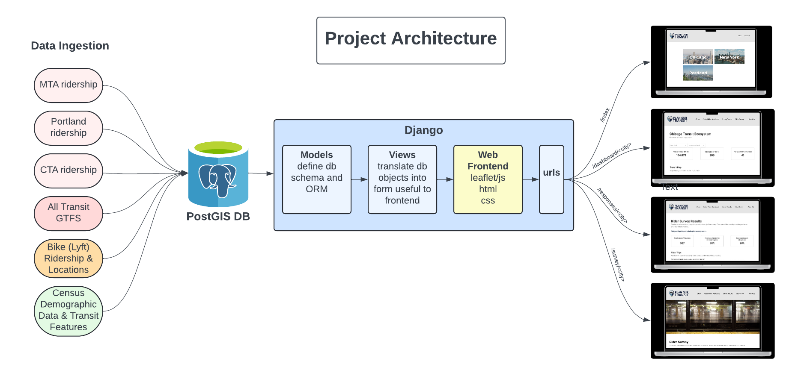

# Architecture and Deployment

## Architecture
High level overview of the architecure:


## Deployment

### Database
Currently we are working with a PostGIS database using a Postgres database that was set up by James (he has the credentials). 

If we need to deploy our own db, update here!

### Django App
#### Backend

To load the database tables:
1. Make sure you have all of the python dependencies installed
2. Make sure you have all of the database (and other) credentials in your `.env` folder
3. Install [gdal](https://gdal.org/index.html) in your machine
    - If working on an Intel chip Mac you can run `brew install gdal`
    - TODO update for otherr use cases
4. Run:
```
$ cd app
# python -m manage makemigrations
$ python -m manage migrate
```
5. Database tables should be established, you can double check by logging into the database using postico or some other postgres login tool

### Ingestion
Ingestion scripts are not finalized.

To get data from cities' GTFS and ingest it to PostGIS database backend, navigate to the
`app` folder and run `python -m manage runscript extract_scheduled_gtfs`.
As of now, it is only a "test" script that runs a process to ingest the transit
stations from Chicago's Metra system; it will be expanded out to ingest more kinds
of data in the coming days.

### Frontend
To run the webserver locally (again make sure you have dependencies installed and `.env` up to date)

Run:
```
cd app/
python -m manage runserver
```

To deploy the production service, we are using heroku. 
** Note: we applied for heroku education credits to deploy for free to heroku (this is a one time task)

